# MatconLi - Recipe Sharing Android Application

> **Academic Project Documentation**  
> A comprehensive guide for oral exam defense and technical deep-dive

---

## 📋 Table of Contents

1. [Project Overview](#project-overview)
2. [Part 1: Architectural Deep-Dive](#part-1-architectural-deep-dive)
3. [Part 2: Technical Implementation](#part-2-technical-implementation)
4. [Part 3: Anticipated Exam Questions](#part-3-anticipated-exam-questions)
5. [Data Flow Diagrams](#data-flow-diagrams)
6. [Technology Stack](#technology-stack)

---

## Project Overview

**MatconLi** is a recipe sharing Android application built using modern Android development best practices. Users can:

- **Register and authenticate** using Firebase Authentication
- **Create, read, update, and delete** their own recipes (CRUD operations)
- **Browse recipes** shared by all users in a centralized feed
- **Search external recipes** from TheMealDB API
- **Edit their profile** (name and avatar image)
- **Upload images** to Cloudinary or Firebase Storage
- **Access data offline** using Room Database as the single source of truth

### Key Design Principle: **Offline-First Architecture**

The app is designed to work seamlessly **even without internet connectivity** by maintaining a local database (Room) that syncs with remote data sources (Firebase Firestore, MealDB API).

---

## Part 1: Architectural Deep-Dive

### 1.1 MVVM Pattern (Model-View-ViewModel)

**MVVM** is an architectural pattern that separates the business logic from the UI, making the code more maintainable, testable, and lifecycle-aware.

#### **The Three Layers:**

```
┌─────────────────────────────────────────────────────────────┐
│                         VIEW LAYER                          │
│  (Fragments/Activities - UI Components)                     │
│  • RecipeListFragment.kt                                    │
│  • RecipeDetailFragment.kt                                  │
│  • LoginFragment.kt                                         │
└─────────────────────────────────────────────────────────────┘
                           ▲
                           │ Observes LiveData
                           │ (UI Updates Automatically)
                           ▼
┌─────────────────────────────────────────────────────────────┐
│                      VIEWMODEL LAYER                        │
│  (Business Logic & State Management)                        │
│  • AuthViewModel.kt                                         │
│  • UserViewModel.kt                                         │
│  • ExternalSearchViewModel.kt                              │
└─────────────────────────────────────────────────────────────┘
                           ▲
                           │ Calls Repository Methods
                           │ Receives LiveData/Callbacks
                           ▼
┌─────────────────────────────────────────────────────────────┐
│                     REPOSITORY LAYER                        │
│  (Data Management - Single Source of Truth)                 │
│  • RecipeRepository.kt                                      │
│  • UserRepository.kt                                        │
│  • RemoteRecipeRepository.kt                               │
└─────────────────────────────────────────────────────────────┘
                           ▲
                           │ Fetches/Saves Data
                           ▼
┌─────────────────────────────────────────────────────────────┐
│                       DATA SOURCES                          │
│  • Room Database (Local Cache)                              │
│  • Firebase Firestore (Remote Storage)                      │
│  • MealDB API (External Data)                               │
│  • Cloudinary (Image Storage)                               │
└─────────────────────────────────────────────────────────────┘
```

#### **Why MVVM is Better Than Putting Everything in Activity/Fragment:**

| Problem with Activity-Only Approach | MVVM Solution |
|-------------------------------------|---------------|
| **Configuration Changes (Rotation)**: Data is lost when the screen rotates because the Activity is destroyed and recreated | **ViewModel survives configuration changes** - Data persists across rotations |
| **Tight Coupling**: Business logic mixed with UI code makes testing difficult | **Separation of Concerns**: ViewModels can be unit-tested without Android dependencies |
| **Memory Leaks**: Async operations with Activity context can cause leaks | **Lifecycle Awareness**: ViewModel automatically cancels operations when Fragment is destroyed |
| **Code Duplication**: Same logic repeated across multiple screens | **Reusable ViewModels**: Share logic across different Fragments |

#### **Lifecycle Awareness Example:**

```kotlin
// Fragment (View Layer)
class RecipeListFragment : BaseFragment() {
    // ViewModel survives screen rotation
    private val viewModel: ExternalSearchViewModel by viewModels()
    
    override fun onViewCreated(view: View, savedInstanceState: Bundle?) {
        // Observe LiveData - UI updates automatically when data changes
        viewModel.recipes.observe(viewLifecycleOwner) { recipes ->
            adapter.updateRecipes(recipes)
        }
    }
}
```

**Key Point**: When the screen rotates, the Fragment is destroyed and recreated, but the **ViewModel persists**, retaining all data (recipes, loading state, errors). The new Fragment instance simply re-observes the same ViewModel.

---

### 1.2 Offline-First Logic: Single Source of Truth

#### **What is "Single Source of Truth"?**

In this architecture, **Room Database** is the **only data source** that the UI directly observes. All remote data (Firebase, APIs) is first saved to Room, then the UI reads from Room via **LiveData**.

**Why?**
- ✅ **Offline Access**: Users can view recipes even without internet
- ✅ **Consistency**: UI always shows the same data regardless of network status
- ✅ **Performance**: Reading from local database is much faster than network calls
- ✅ **Simplicity**: UI logic doesn't need to handle network errors or loading states separately

#### **Data Flow: From API to UI**


#### **Code Example: RecipeRepository.kt**

```kotlin
class RecipeRepository {
    // Room is the single source of truth
    private val database: AppLocalDbRepository = AppLocalDB.db
    
    // UI observes this - always returns Room LiveData
    fun getAllRecipes(): LiveData<MutableList<Recipe>> {
        return database.recipeDao().getAll()  // ← UI gets data from Room
    }
    
    // Background sync - fetches from Firebase and saves to Room
    fun refreshRecipes() {
        val lastUpdated = Recipe.lastUpdated  // Timestamp of last sync
        
        firebaseModel.getAllRecipes(lastUpdated) { recipesList ->
            executor.execute {
                // Save to Room - LiveData automatically notifies UI
                for (recipe in recipesList) {
                    database.recipeDao().insert(recipe)  // ← Room is updated
                }
            }
        }
    }
}
```

**Critical Concept**: The UI **never** directly accesses Firebase or the API. It only observes Room's LiveData. The Repository handles syncing in the background.

#### **Firebase Offline Persistence is DISABLED**

```kotlin
// MyApplication.kt
private fun disableFirebasePersistence() {
    val settings = FirebaseFirestoreSettings.Builder()
        .setPersistenceEnabled(false)  // ← Explicitly disabled
        .build()
    FirebaseFirestore.getInstance().firestoreSettings = settings
}
```

**Why disable it if we want offline access?**
- We use **Room** for offline caching, not Firebase's built-in cache
- This gives us **full control** over when and how data is synced
- Room supports **SQL queries** (filter, search, sort) which Firebase cache doesn't
- Avoids **data conflicts** between Firebase cache and Room

---

### 1.3 Dependency Injection / Initialization

#### **Singleton Pattern for Repositories**

Repositories are created as **singletons** (one instance shared across the entire app):

```kotlin
// RecipeRepository.kt
class RecipeRepository private constructor() {
    companion object {
        val shared = RecipeRepository()  // ← Singleton instance
    }
    
    // Dependencies are initialized immediately (not lazy)
    private val storageModel = StorageModel()
    private val firebaseModel = FirebaseModel()
    private val database: AppLocalDbRepository = AppLocalDB.db
}
```

**Why Singleton?**
- ✅ **Prevents duplicate database connections** (opening multiple Room instances would cause corruption)
- ✅ **Shared state** - All ViewModels see the same data
- ✅ **Memory efficient** - Only one instance of heavy objects (Executor, Handler, Firebase clients)

#### **Database Initialization**

```kotlin
// AppLocalDB.kt
object AppLocalDB {
    val db: AppLocalDbRepository = run {
        val appContext = MyApplication.Globals.appContext
        
        Room.databaseBuilder(
            appContext!!,
            AppLocalDbRepository::class.java,
            "matconli_database.db"
        )
        .fallbackToDestructiveMigration()  // ← Clear DB if schema changes
        .build()
    }
}
```

**Key Points**:
- **`object AppLocalDB`**: Kotlin's built-in singleton pattern
- **Immediate initialization** (not `by lazy`) - Database is ready immediately when app starts
- **Application Context**: Uses the global app context (survives Activity lifecycle)
- **Destructive Migration**: For academic projects, we prioritize simplicity over production-grade migrations

---

## Part 2: Technical Implementation

### 2.1 Room & SQLite

#### **What is Room?**

**Room** is an **abstraction layer** over SQLite. It converts Kotlin objects to database rows automatically.

**Components**:
1. **Entity** - Defines the table structure
2. **DAO (Data Access Object)** - Defines database operations
3. **Database** - Holds the DAOs and manages the SQLite connection

#### **Entity Example: Recipe.kt**

```kotlin
@Entity  // ← This class becomes a table
data class Recipe(
    @PrimaryKey
    val id: String,
    val title: String,
    val description: String,
    val imageUrl: String?,
    val ownerId: String,
    val lastUpdated: Long?
)
```

**Generated SQL**:
```sql
CREATE TABLE Recipe (
    id TEXT PRIMARY KEY NOT NULL,
    title TEXT NOT NULL,
    description TEXT NOT NULL,
    imageUrl TEXT,
    ownerId TEXT NOT NULL,
    lastUpdated INTEGER
);
```

#### **DAO Example: RecipeDao.kt**

```kotlin
@Dao
interface RecipeDao {
    @Query("SELECT * FROM Recipe")
    fun getAll(): LiveData<MutableList<Recipe>>  // ← LiveData auto-updates UI
    
    @Query("SELECT * FROM Recipe WHERE id = :id")
    fun getById(id: String): Recipe?  // ← Direct query
    
    @Insert(onConflict = OnConflictStrategy.REPLACE)
    fun insert(recipe: Recipe)  // ← Room generates INSERT OR REPLACE SQL
    
    @Update
    fun update(recipe: Recipe)
    
    @Delete
    fun delete(recipe: Recipe)
}
```

#### **Why DAO Instead of Raw SQL?**

| Raw SQL Approach | DAO Approach |
|------------------|--------------|
| `db.rawQuery("SELECT * FROM Recipe WHERE id = ?", arrayOf(id))` <br> **Cons**: Typos in SQL strings aren't caught until runtime | `recipeDao.getById(id)` <br> **Pros**: Compile-time verification - errors caught before running |
| `ContentValues values = new ContentValues();`<br>`values.put("title", recipe.title);`<br>`db.insert("Recipe", null, values);` | `recipeDao.insert(recipe)` <br> **Pros**: One line, type-safe |
| Manual cursor parsing: <br> `cursor.moveToFirst()`<br>`val title = cursor.getString(1)` | `LiveData<Recipe>` automatically parsed <br> **Pros**: No boilerplate code |
| Manual threading (AsyncTask, Handlers) | `suspend fun` built-in coroutine support |

**Example of SQL Injection Risk (Raw SQL)**:
```kotlin
// DANGEROUS - Vulnerable to SQL injection
val query = "SELECT * FROM Recipe WHERE title = '$userInput'"
db.rawQuery(query, null)  // ← If userInput is "'; DROP TABLE Recipe;--" 💥
```

**DAO Prevents This**:
```kotlin
@Query("SELECT * FROM Recipe WHERE title = :userInput")
fun searchByTitle(userInput: String): List<Recipe>  // ← Parameterized query, safe
```

---

### 2.2 Navigation Component

#### **What is Navigation Component?**

A framework for handling **fragment transactions** and **backstack management** in a declarative way.

**Components**:
1. **`nav_graph.xml`** - Visual map of all screens and navigation paths
2. **`NavHostFragment`** - Container that swaps fragments
3. **SafeArgs** - Type-safe argument passing between screens

#### **nav_graph.xml Structure**

```xml
<navigation xmlns:android="http://schemas.android.com/apk/res/android"
    android:id="@+id/nav_graph"
    app:startDestination="@id/loginFragment">
    
    <!-- Login Screen -->
    <fragment
        android:id="@+id/loginFragment"
        android:name="com.colman.matconli.features.auth.LoginFragment">
        
        <action
            android:id="@+id/action_loginFragment_to_feedFragment"
            app:destination="@id/feedFragment"
            app:popUpTo="@id/loginFragment"
            app:popUpToInclusive="true"/>  <!-- ← Remove login from backstack -->
    </fragment>
    
    <!-- Recipe Feed -->
    <fragment
        android:id="@+id/feedFragment"
        android:name="com.colman.matconli.features.feed.RecipeListFragment">
        
        <action
            android:id="@+id/action_feedFragment_to_recipeDetailFragment"
            app:destination="@id/recipeDetailFragment"/>
    </fragment>
    
    <!-- Recipe Detail -->
    <fragment
        android:id="@+id/recipeDetailFragment"
        android:name="com.colman.matconli.features.recipe.RecipeDetailFragment">
        
        <argument
            android:name="recipeId"
            app:argType="string"/>  <!-- ← SafeArgs generates type-safe class -->
    </fragment>
</navigation>
```

#### **NavHostFragment in Activity**

```xml
<!-- activity_main.xml -->
<androidx.fragment.app.FragmentContainerView
    android:id="@+id/nav_host_fragment"
    android:name="androidx.navigation.fragment.NavHostFragment"
    app:navGraph="@navigation/nav_graph"
    app:defaultNavHost="true"/>  <!-- ← Handles back button -->
```

#### **Why SafeArgs is Essential**

**Old Way (Bundle - NOT Type-Safe)**:
```kotlin
// Sender Fragment
val bundle = Bundle()
bundle.putString("recipe_id", recipeId)  // ← Typo in key? Runtime crash!
findNavController().navigate(R.id.recipeDetailFragment, bundle)

// Receiver Fragment
val recipeId = arguments?.getString("recipe_id")  // ← Returns String?, could be null
```

**SafeArgs Way (Type-Safe)**:
```kotlin
// Sender Fragment
val action = RecipeListFragmentDirections
    .actionFeedFragmentToRecipeDetailFragment(recipeId = "123")  // ← Auto-generated
findNavController().navigate(action)

// Receiver Fragment
val args: RecipeDetailFragmentArgs by navArgs()  // ← Auto-generated
val recipeId: String = args.recipeId  // ← Non-null, guaranteed to exist
```

**Benefits**:
- ✅ **Compile-time safety** - Typos in keys are impossible
- ✅ **Null-safety** - Required arguments can't be null
- ✅ **Refactoring support** - IDE can rename arguments across all usages
- ✅ **Autocomplete** - IDE suggests available actions and arguments

---

### 2.3 Firebase Auth: Session Persistence

#### **How Session Persistence Works**

Firebase Auth automatically saves the user's login state to **encrypted SharedPreferences**. This state survives:
- ✅ App closing
- ✅ Device reboot
- ✅ App re-installation (if using Google Backup)

#### **Session Flow**


#### **Code Example: Auto-Login Check**

```kotlin
// LoginFragment.kt
override fun onViewCreated(view: View, savedInstanceState: Bundle?) {
    super.onViewCreated(view, savedInstanceState)
    
    // Check if user is already logged in
    if (viewModel.isLoggedIn()) {
        navigateToFeed()  // ← Skip login screen
        return
    }
    
    setupClickListeners()
    observeAuthState()
}

// AuthViewModel.kt
fun isLoggedIn(): Boolean {
    return authModel.currentUser != null  // ← Firebase returns saved user
}

// FirebaseAuthModel.kt
val currentUser: FirebaseUser?
    get() = FirebaseAuth.getInstance().currentUser  // ← Reads from SharedPreferences
```

#### **Session Token Storage Location**

Firebase stores the session token in:
```
/data/data/com.colman.matconli/shared_prefs/
└── com.google.firebase.auth.api.Store
```

**Encryption**: The token is encrypted using the Android KeyStore system.

#### **Logout Implementation**

```kotlin
// ProfileFragment.kt
binding.fragmentProfileButtonLogout.setOnClickListener {
    performLogout(ProfileFragmentDirections.actionProfileFragmentToLoginFragment())
}

// BaseFragment.kt
protected fun performLogout(loginNavDirection: NavDirections) {
    (activity as? MainActivity)?.clearUserProfile()
    authModel.signOut()  // ← Clears SharedPreferences
    findNavController().navigate(loginNavDirection)
}

// FirebaseAuthModel.kt
fun signOut() {
    FirebaseAuth.getInstance().signOut()  // ← Removes session token
}
```

---

### 2.4 Concurrency: Preventing UI Freezing

#### **NetworkOnMainThreadException**

Android **forbids** network operations on the main (UI) thread. If attempted:

```kotlin
// ❌ THIS WILL CRASH
class RecipeListFragment : Fragment() {
    override fun onViewCreated(view: View, savedInstanceState: Bundle?) {
        val response = NetworkClient.mealDbClient.searchMeals("chicken").execute()
        // 💥 CRASH: android.os.NetworkOnMainThreadException
    }
}
```

**Why?**
- Network requests can take **seconds** to complete
- The main thread must render UI at **60 FPS** (16ms per frame)
- **Blocking** the main thread = frozen UI = "Application Not Responding" (ANR) dialog

#### **Solution 1: Background Threads (RecipeRepository)**

```kotlin
class RecipeRepository {
    // Single background thread for database operations
    private val executor = Executors.newSingleThreadExecutor()
    
    // Handler to post results back to main thread
    private val mainHandler = Handler.createAsync(Looper.getMainLooper())
    
    fun refreshRecipes() {
        // Step 1: Network call (happens on caller's thread)
        firebaseModel.getAllRecipes(lastUpdated) { recipesList ->
            
            // Step 2: Database write (background thread)
            executor.execute {
                for (recipe in recipesList) {
                    database.recipeDao().insert(recipe)  // ← Off main thread
                }
            }
        }
    }
}
```

#### **Solution 2: Kotlin Coroutines (ExternalSearchViewModel)**

```kotlin
class ExternalSearchViewModel : ViewModel() {
    fun searchRecipes(query: String) {
        isLoadingMutable.value = true  // ← Main thread
        
        // Launch coroutine in ViewModel scope
        viewModelScope.launch {
            try {
                // Switch to IO thread for network call
                val result = withContext(Dispatchers.IO) {
                    RemoteRecipeRepository.shared.searchRecipes(query)  // ← Background
                }
                
                // Automatically back on main thread
                recipesMutable.value = result.meals ?: emptyList()  // ← Main thread
                isLoadingMutable.value = false
            } catch (e: Exception) {
                errorMutable.value = "Failed: ${e.message}"
                isLoadingMutable.value = false
            }
        }
    }
}
```

**Dispatchers Explained**:
- **`Dispatchers.IO`** - For network/database operations (background threads)
- **`Dispatchers.Main`** - For UI updates (main thread) - **Default in viewModelScope**
- **`Dispatchers.Default`** - For CPU-intensive work (background threads)

#### **ProgressBar Pattern**

Every async operation shows a **ProgressBar** to give user feedback:

```kotlin
// RecipeDetailFragment.kt
private fun loadRecipe() {
    binding?.fragmentRecipeDetailProgressBar?.show()  // ← Show spinner
    
    RecipeRepository.shared.getRecipeById(args.recipeId) { recipe ->
        activity?.runOnUiThread {
            binding?.fragmentRecipeDetailProgressBar?.hide()  // ← Hide spinner
            recipe?.let { displayRecipe(it) }
        }
    }
}
```

**Visual Indicators Used**:
1. **ProgressBar** (Spinner) - For loading data
2. **SwipeRefreshLayout** - For pull-to-refresh gestures
3. **Button.isEnabled = false** - Prevent double-clicks during save operations

---

## Part 3: Anticipated Exam Questions

### ❓ Q1: "Why did you use Room if the data is already in Firebase/API?"

**Answer**:

While Firebase Firestore and the MealDB API provide remote data storage, they have critical limitations that Room addresses:

#### **1. Offline Access**
- **Problem**: If the user has no internet connection, Firebase and API calls fail completely. The app would be unusable.
- **Solution**: Room stores a **local copy** of all data. Users can view recipes, see their profile, and browse the feed even on an airplane or in a subway.

**Code Evidence**:
```kotlin
// UI ONLY observes Room - never Firebase
fun getAllRecipes(): LiveData<MutableList<Recipe>> {
    return database.recipeDao().getAll()  // ← Local database
}
```

#### **2. Performance**
- **Firebase Query**: 200-500ms (network latency)
- **Room Query**: 1-5ms (local disk read)

**Impact**: The feed loads **100x faster** for repeat visits because data is cached locally.

#### **3. Advanced Queries**
Room supports **SQL queries** that Firebase doesn't:

```kotlin
// Room DAO
@Query("SELECT * FROM Recipe WHERE ownerId = :userId ORDER BY lastUpdated DESC")
fun getRecipesByUser(userId: String): LiveData<List<Recipe>>

// Firebase equivalent - must download ALL recipes and filter in memory (inefficient!)
```

#### **4. Cost Optimization**
Firebase charges per document read. With Room:
- First load: Download from Firebase ✅
- Subsequent loads: Read from Room (free) ✅
- Only sync **changed** data using timestamps

```kotlin
// Only fetch recipes updated since last sync
firebaseModel.getAllRecipes(since = lastUpdated) { newRecipes ->
    // Incremental sync, not full download
}
```

#### **5. Single Source of Truth**
Having **two** sources (Firebase + UI) creates complexity:
- What if Firebase is loading but user rotates screen?
- What if Firebase fails but we had old data?

Room as the **single source** means:
- ✅ UI logic is simple: "Just observe Room"
- ✅ Repository handles all sync complexity in background

---

### ❓ Q2: "What happens to the data when the screen rotates?"

**Answer**:

Screen rotation triggers an **Activity/Fragment destruction and recreation**. However, data survives due to **ViewModel architecture**.

#### **Lifecycle Breakdown**

```mermaid
sequenceDiagram
    participant User
    participant Fragment
    participant ViewModel
    participant Repository
    participant Room

    Note over User,Room: Initial Load (Portrait Mode)
    User->>Fragment: Opens RecipeList
    Fragment->>ViewModel: by viewModels()
    ViewModel->>Repository: getAllRecipes()
    Repository->>Room: getAll()
    Room-->>Fragment: LiveData [Recipe1, Recipe2]
    
    Note over User,Room: User Rotates Device
    User->>Fragment: Rotates Screen
    Fragment->>Fragment: onDestroyView() ❌
    Note over Fragment: binding = null
    Fragment->>Fragment: onDestroy() ❌
    
    Note over ViewModel: ViewModel SURVIVES ✅
    Note over Room: Room Database SURVIVES ✅
    
    Fragment->>Fragment: onCreate() (New Instance)
    Fragment->>ViewModel: by viewModels() (Same Instance!)
    Fragment->>Fragment: onViewCreated()
    ViewModel-->>Fragment: Existing LiveData [Recipe1, Recipe2]
    Note over Fragment: UI Restored Instantly (No Network Call!)
```



#### **Code Evidence**

```kotlin
class RecipeListFragment : BaseFragment() {
    // ViewModel is scoped to Fragment's ViewModelStore (survives rotation)
    private val viewModel: ExternalSearchViewModel by viewModels()
    
    override fun onViewCreated(view: View, savedInstanceState: Bundle?) {
        // After rotation, this observes the SAME ViewModel instance
        viewModel.recipes.observe(viewLifecycleOwner) { recipes ->
            adapter.updateRecipes(recipes)  // ← Data is still there!
        }
    }
}
```

#### **What Gets Destroyed vs. Preserved**

| Component | Rotation Behavior | Why |
|-----------|-------------------|-----|
| **Fragment Instance** | ❌ Destroyed | Android recreates with new configuration (landscape layout, etc.) |
| **ViewBinding** | ❌ Destroyed | Views are destroyed, `binding = null` in `onDestroyView()` |
| **ViewModel** | ✅ Preserved | Stored in `ViewModelStore`, cleared only on permanent destruction |
| **LiveData** | ✅ Preserved | Lives inside ViewModel |
| **Repository** | ✅ Preserved | Singleton instance |
| **Room Database** | ✅ Preserved | Singleton instance |
| **Local Variables** | ❌ Destroyed | Lost when Fragment is destroyed |

#### **Alternative Approaches (Why They're Worse)**

**1. Saved Instance State (Old Way)**:
```kotlin
// ❌ Limited to small data (< 1MB), cumbersome
override fun onSaveInstanceState(outState: Bundle) {
    outState.putParcelableArrayList("recipes", ArrayList(recipes))
}
```

**2. Static Variables**:
```kotlin
// ❌ Memory leaks, survives app exit
companion object {
    var recipes: List<Recipe>? = null  // Don't do this!
}
```

**3. Reload from Network**:
```kotlin
// ❌ Wastes bandwidth, slow, bad UX
override fun onViewCreated(view: View, savedInstanceState: Bundle?) {
    fetchRecipesFromFirebase()  // Every rotation = new network call!
}
```

---

### ❓ Q3: "How do you ensure a user can't delete someone else's post?"

**Answer**:

This is enforced through **UI restrictions** and **backend rules**.

#### **Frontend Validation (UI Layer)**

```kotlin
// RecipeDetailFragment.kt
private fun displayRecipe(recipe: Recipe) {
    binding?.fragmentRecipeDetailTextViewTitle?.text = recipe.title
    binding?.fragmentRecipeDetailTextViewDescription?.text = recipe.description
    
    // OWNERSHIP CHECK
    val currentUserId = getCurrentUserId()  // ← Firebase Auth user ID
    if (currentUserId == recipe.ownerId) {
        // Only show Edit/Delete buttons if user owns this recipe
        binding?.fragmentRecipeDetailButtonEdit?.visibility = View.VISIBLE
        binding?.fragmentRecipeDetailButtonDelete?.visibility = View.VISIBLE
    } else {
        // Hide buttons for other users' recipes
        binding?.fragmentRecipeDetailButtonEdit?.visibility = View.GONE
        binding?.fragmentRecipeDetailButtonDelete?.visibility = View.GONE
    }
}
```

**Visual Example**:

```
┌─────────────────────────────────────────┐
│  Recipe: Chocolate Cake                 │
│  By: user123                            │
│                                         │
│  Delicious chocolate cake recipe...     │
│                                         │
│  Current User: user123                  │
│  ← Ownership Match ✅                   │
│                                         │
│  [Edit] [Delete]  ← Buttons Visible     │
└─────────────────────────────────────────┘

┌─────────────────────────────────────────┐
│  Recipe: Chocolate Cake                 │
│  By: user123                            │
│                                         │
│  Delicious chocolate cake recipe...     │
│                                         │
│  Current User: user456                  │
│  ← Ownership Mismatch ❌                │
│                                         │
│  (No Buttons) ← Hidden for Other Users  │
└─────────────────────────────────────────┘
```

#### **Backend Rules (Firebase Security Rules)**

Frontend validation can be bypassed (e.g., using Postman to call the API directly). The **backend must also validate**:

```javascript
// Firestore Security Rules (firestore.rules)
service cloud.firestore {
  match /databases/{database}/documents {
    match /recipes/{recipeId} {
      // Allow read for all authenticated users
      allow read: if request.auth != null;
      
      // Allow create only if ownerId matches the authenticated user
      allow create: if request.auth != null 
                    && request.resource.data.ownerId == request.auth.uid;
      
      // Allow update/delete only if user owns the recipe
      allow update, delete: if request.auth != null 
                            && resource.data.ownerId == request.auth.uid;
    }
  }
}
```

**How It Works**:
1. User tries to delete a recipe
2. App sends request to Firebase with **auth token**
3. Firebase checks: `resource.data.ownerId == request.auth.uid`
4. If false → Request denied (403 Forbidden)

#### **Additional Security: "My Recipes" Filter**

```kotlin
// MyRecipesFragment.kt
private fun observeRecipes() {
    RecipeRepository.shared.getAllRecipes().observe(viewLifecycleOwner) { recipes ->
        // Show only recipes owned by current user
        val myRecipes = recipes.filter { it.ownerId == userId }
        adapter.updateRecipes(myRecipes)
    }
}
```

**Why This Matters**:
- ✅ Users can't accidentally delete others' recipes
- ✅ Prevents malicious users from using tools like Charles Proxy to intercept requests
- ✅ Defense-in-depth: Both client and server validate

---

### ❓ Q4: "What is the benefit of LiveData over a regular variable?"

**Answer**:

**LiveData** is a **lifecycle-aware observable** data holder. This means:

#### **1. Automatic UI Updates (Observer Pattern)**

**Regular Variable** ❌:
```kotlin
class RecipeListFragment : Fragment() {
    var recipes: List<Recipe> = emptyList()  // Regular variable
    
    fun loadRecipes() {
        RecipeRepository.shared.getAllRecipes { newRecipes ->
            recipes = newRecipes
            // ❌ UI DOESN'T UPDATE - must manually call:
            adapter.updateRecipes(recipes)
            binding?.fragmentFeedTextViewEmpty?.visibility = 
                if (recipes.isEmpty()) View.VISIBLE else View.GONE
        }
    }
}
```

**LiveData** ✅:
```kotlin
class RecipeListFragment : Fragment() {
    override fun onViewCreated(view: View, savedInstanceState: Bundle?) {
        // Observe LiveData once
        RecipeRepository.shared.getAllRecipes().observe(viewLifecycleOwner) { recipes ->
            // This block runs AUTOMATICALLY whenever data changes
            adapter.updateRecipes(recipes)
            binding?.fragmentFeedTextViewEmpty?.visibility = 
                if (recipes.isEmpty()) View.VISIBLE else View.GONE
        }
    }
}
```

**What Happens**:
```
Room Database Updated → LiveData Notifies Observers → UI Callback Runs → UI Updates
```

**No manual calls needed!**

#### **2. Lifecycle Awareness (Prevents Crashes)**

**Regular Variable** ❌:
```kotlin
class RecipeListFragment : Fragment() {
    fun loadRecipes() {
        RecipeRepository.shared.getAllRecipes { recipes ->
            // ❌ CRASH if Fragment is destroyed:
            binding?.fragmentFeedRecyclerView?.adapter = ...
            // java.lang.IllegalStateException: Fragment not attached to Activity
        }
    }
}
```

**LiveData** ✅:
```kotlin
// LiveData observes Fragment's lifecycle
viewModel.recipes.observe(viewLifecycleOwner) { recipes ->
    // ✅ This code ONLY runs when Fragment is ACTIVE (STARTED or RESUMED)
    // If Fragment is destroyed, callback is NOT invoked
    adapter.updateRecipes(recipes)
}
```

**Lifecycle States**:
```
DESTROYED → INITIALIZED → CREATED → STARTED → RESUMED
                                       ▲
                                       │
                            LiveData updates delivered here
```

**When Fragment is in background** (paused) → LiveData **queues** updates and delivers them when Fragment returns to foreground.

#### **3. No Memory Leaks**

**Regular Variable with Callback** ❌:
```kotlin
class RecipeListFragment : Fragment() {
    init {
        RecipeRepository.shared.registerCallback { recipes ->
            updateUI(recipes)  // ← Holds reference to Fragment
        }
    }
    
    // ❌ If we forget to unregister, Fragment leaks when destroyed
}
```

**LiveData** ✅:
```kotlin
viewModel.recipes.observe(viewLifecycleOwner) { recipes ->
    updateUI(recipes)
}
// ✅ Automatically unregisters when Fragment is destroyed
```

#### **4. Configuration Change Handling**

**Regular Variable** ❌:
```kotlin
// Screen rotates → Fragment destroyed → recipes = emptyList() (lost!)
```

**LiveData** ✅:
```kotlin
// LiveData lives in ViewModel → survives rotation → data persists
```

#### **5. Prevents Duplicate Work**

```kotlin
// Two fragments observing the same LiveData
class RecipeListFragment : Fragment() {
    override fun onViewCreated(view: View, savedInstanceState: Bundle?) {
        RecipeRepository.shared.getAllRecipes().observe(viewLifecycleOwner) { recipes ->
            // Both fragments receive updates from same database query
        }
    }
}

class MyRecipesFragment : Fragment() {
    override fun onViewCreated(view: View, savedInstanceState: Bundle?) {
        RecipeRepository.shared.getAllRecipes().observe(viewLifecycleOwner) { recipes ->
            // Filters to show only user's recipes
            val myRecipes = recipes.filter { it.ownerId == userId }
        }
    }
}
```

**Efficiency**: Only **one** database query runs, both fragments observe the same LiveData instance.

---

### ❓ Q5: "Why is it forbidden to perform network operations on the Main Thread?"

**Answer**:

Android enforces this rule with **`NetworkOnMainThreadException`** to prevent **UI freezing** and **ANR (Application Not Responding)** dialogs.

#### **The Main Thread's Job**

The main thread (also called **UI thread**) has **one critical responsibility**: Render the UI at **60 frames per second**.

**Frame Budget**: 
```
60 FPS = 1000ms / 60 = 16.67ms per frame
```

Every 16ms, the main thread must:
1. **Measure** layouts
2. **Draw** UI elements
3. **Handle** touch events
4. **Animate** transitions

If **any operation takes longer than 16ms**, frames are **dropped** → UI stutters.

#### **Network Call Duration**

```
Typical Network Call Timeline:
├─ DNS Lookup: 50-200ms
├─ TCP Handshake: 100-500ms
├─ TLS Handshake: 200-600ms
├─ HTTP Request/Response: 100-2000ms
└─ Total: 450-3300ms (27-198 frames dropped!)
```

**Result**: The screen **freezes** for 3+ seconds → terrible UX.

#### **What Happens if You Try**

```kotlin
class RecipeListFragment : Fragment() {
    override fun onViewCreated(view: View, savedInstanceState: Bundle?) {
        // ❌ This code WILL CRASH on Android 3.0+
        val response = NetworkClient.mealDbClient.searchMeals("pasta").execute()
        
        // 💥 android.os.NetworkOnMainThreadException
    }
}
```

**Exception Stack Trace**:
```
android.os.NetworkOnMainThreadException
    at android.os.StrictMode$AndroidBlockGuardPolicy.onNetwork(StrictMode.java:1605)
    at java.net.InetAddress.lookupHostByName(InetAddress.java:453)
    at java.net.InetAddress.getAllByNameImpl(InetAddress.java:252)
```

#### **ANR Dialog**

If the main thread is blocked for **5+ seconds**, Android shows:

```
┌─────────────────────────────────────────┐
│  MatconLi isn't responding              │
│                                         │
│  Do you want to close it?               │
│                                         │
│  [Wait]  [Close App]                    │
└─────────────────────────────────────────┘
```

**Impact**: 
- Users force-close your app
- Negative reviews ("App is slow and crashes")
- Google Play flags your app for poor performance

#### **The Correct Way: Background Threads**

**Solution 1: Executor (Java-style Threading)**
```kotlin
private val executor = Executors.newSingleThreadExecutor()

fun loadRecipes() {
    executor.execute {
        // ✅ Runs on background thread
        val response = NetworkClient.mealDbClient.searchMeals("pasta").execute()
        
        // ❌ Can't update UI here! Must switch back to main thread:
        mainHandler.post {
            updateUI(response)  // ✅ UI update on main thread
        }
    }
}
```

**Solution 2: Kotlin Coroutines (Modern)**
```kotlin
fun searchRecipes(query: String) {
    viewModelScope.launch {  // ← Main thread by default
        try {
            val result = withContext(Dispatchers.IO) {
                // ✅ Switches to IO thread for network call
                RemoteRecipeRepository.shared.searchRecipes(query)
            }
            // ✅ Automatically back on main thread
            recipesMutable.value = result.meals
        } catch (e: Exception) {
            errorMutable.value = "Network error"
        }
    }
}
```

#### **Visual: Thread Execution**

```
Main Thread:          [UI Render][UI Render][UI Render][UI Render]...
                               ↓
                         launch coroutine
                               ↓
Background Thread:            [Network Call (3 seconds)]
                                         ↓
Main Thread:                         [Update UI]
                      [UI Render][UI Render][UI Render]...
                      ↑
                UI never freezes!
```

#### **Why Room Queries Are Allowed on Main Thread**

Room queries are **fast** (1-5ms) but still discouraged on main thread for large datasets:

```kotlin
// ✅ LiveData queries run on background thread automatically
@Query("SELECT * FROM Recipe")
fun getAll(): LiveData<List<Recipe>>  // ← Room handles threading

// ❌ Direct queries block main thread
@Query("SELECT * FROM Recipe")
fun getAllSync(): List<Recipe>  // ← Use with caution
```

**Best Practice**: Always use `LiveData` or `suspend fun` with Room.

---

## Data Flow Diagrams

### Full CRUD Cycle for Recipes


### Image Upload Flow


---

## Technology Stack

### Core Architecture
- **Language**: Kotlin
- **Architecture Pattern**: MVVM (Model-View-ViewModel)
- **Dependency Injection**: Manual singleton pattern
- **Concurrency**: Kotlin Coroutines + Executors

### Jetpack Components
- **Navigation Component**: Fragment navigation with SafeArgs
- **LiveData**: Lifecycle-aware observables
- **ViewModel**: Survives configuration changes
- **Room**: SQLite abstraction layer
- **ViewBinding**: Type-safe view access

### Backend Services
- **Firebase Authentication**: User registration/login/session management
- **Firebase Firestore**: NoSQL document database (remote storage)
- **Cloudinary**: Cloud-based image storage (primary)
- **Firebase Storage**: Image storage (fallback)

### Networking
- **Retrofit**: Type-safe HTTP client
- **OkHttp**: HTTP client implementation
- **Gson**: JSON serialization/deserialization
- **MealDB API**: External recipe search API

### UI Components
- **Material Design Components**: Buttons, Toolbars, TextInputLayouts
- **RecyclerView**: Efficient list rendering with DiffUtil
- **Picasso**: Image loading and caching library
- **SwipeRefreshLayout**: Pull-to-refresh gesture

### Data Synchronization
- **Manual Sync**: Timestamp-based incremental sync
- **SharedPreferences**: Storing lastUpdated timestamps
- **Offline-First**: Room as single source of truth

---

## Key Exam Defense Points

### 1. **Why This Architecture?**
> "I chose MVVM with Room-based offline-first architecture because it provides the best balance of performance, testability, and user experience. The app works seamlessly offline, survives configuration changes, and separates business logic from UI for easier maintenance."

### 2. **Single Most Important Feature**
> "The **Single Source of Truth** pattern using Room. The UI only observes Room's LiveData, never Firebase or the API. This means consistent behavior regardless of network status, automatic UI updates when data changes, and a simple mental model for developers."

### 3. **Biggest Challenge Solved**
> "Managing the data synchronization between Firebase and Room while ensuring the UI never shows stale data. I implemented timestamp-based incremental sync using SharedPreferences to track the last update time, so we only fetch new/changed recipes instead of re-downloading everything."

### 4. **Production-Ready Considerations**
If asked what would change for a production app:
- **Migration Strategy**: Replace `fallbackToDestructiveMigration()` with proper Room migrations
- **Error Handling**: Add retry logic for network failures
- **Pagination**: Load recipes in pages (100 at a time) instead of all at once
- **Authentication State**: Handle token expiration and refresh
- **Testing**: Add unit tests for ViewModels, integration tests for Repository
- **Firebase Security Rules**: Currently permissive, would add stricter validation
- **Proguard/R8**: Enable code obfuscation for release builds
- **Crashlytics**: Add crash reporting for production monitoring

### 5. **Alternative Approaches Considered**
> "I could have used Firebase's built-in offline persistence instead of Room, but that would limit query capabilities (no SQL), increase dependency on Firebase SDK, and make testing harder. Room gives full control over the local cache."

---

## Project Statistics

- **Total Kotlin Files**: 44+
- **ViewModels**: 3 (AuthViewModel, UserViewModel, ExternalSearchViewModel)
- **Repositories**: 3 (RecipeRepository, UserRepository, RemoteRecipeRepository)
- **Fragments**: 9 (Login, Register, Feed, MyRecipes, RecipeDetail, AddRecipe, Profile, EditProfile, ExternalSearch)
- **Room Entities**: 2 (Recipe, User)
- **DAOs**: 2 (RecipeDao, UserDao)
- **Navigation Actions**: 15+ (defined in nav_graph.xml)
- **Database Version**: 3

---

## Final Checklist for Exam

- ✅ Can explain MVVM layers and their responsibilities
- ✅ Can draw the data flow from API → Repository → Room → LiveData → UI
- ✅ Can explain why Room is needed despite having Firebase
- ✅ Can explain how ViewModel survives screen rotation
- ✅ Can explain how ownership-based permissions work
- ✅ Can explain LiveData vs regular variables
- ✅ Can explain why network operations can't run on main thread
- ✅ Can explain Firebase Auth session persistence
- ✅ Can explain SafeArgs benefits over Bundle
- ✅ Can explain DAO benefits over raw SQL
- ✅ Can describe the Singleton pattern usage
- ✅ Can explain coroutines/threading for concurrency
- ✅ Can discuss production-ready improvements

---

## Additional Resources for Study

### Official Documentation
- [Android Developers: Guide to App Architecture](https://developer.android.com/topic/architecture)
- [Room Persistence Library](https://developer.android.com/training/data-storage/room)
- [LiveData Overview](https://developer.android.com/topic/libraries/architecture/livedata)
- [ViewModel Overview](https://developer.android.com/topic/libraries/architecture/viewmodel)
- [Navigation Component](https://developer.android.com/guide/navigation)

### Key Concepts to Review
1. **Fragment Lifecycle**: onCreate → onCreateView → onViewCreated → onStart → onResume → onPause → onStop → onDestroyView → onDestroy
2. **ViewModel Lifecycle**: Created when Fragment is first created, survives rotation, destroyed only when Fragment is permanently destroyed
3. **LiveData Lifecycle**: Active when observer is STARTED/RESUMED, inactive when STOPPED, removed when DESTROYED
4. **Repository Pattern**: Mediates between data sources and ViewModels, abstracts data layer
5. **Singleton Pattern**: Ensures one instance exists, provides global access point
6. **Observer Pattern**: LiveData notifies observers when data changes
7. **Dependency Inversion**: High-level modules (ViewModels) don't depend on low-level modules (Firebase), both depend on abstractions (Repository interface)

---

**Good luck on your exam! 🚀**

*Remember: The best defense is understanding WHY each decision was made, not just HOW it was implemented.*

💡 How to Use This for Exam Prep
Read Part 3 first - memorize the 5 anticipated questions
Study the Mermaid diagrams - draw them on a whiteboard
Practice explaining the "Single Source of Truth" concept
Review the lifecycle diagrams - this is asked in ~90% of Android exams
Use the "Final Checklist" - ensure you can explain each point